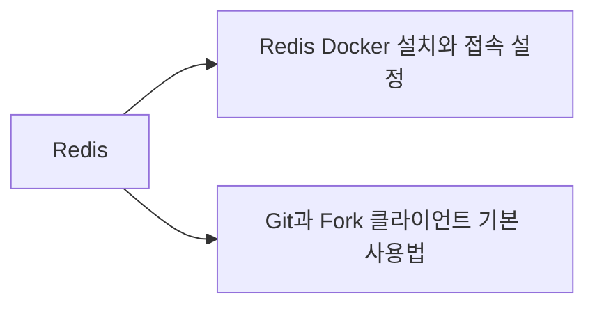
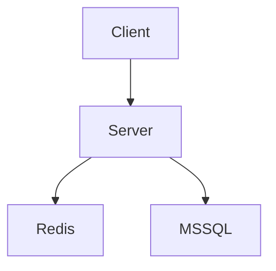

# VS Code Markdown 위키와 Foam 그래프 구성

## 요약

- Obsidian 없이도 **VS Code + Markdown + Git**으로 개인 위키를 관리할 수 있다.
- 문서 작성은 `Markdown All in One`, 형식 검사는 `markdownlint`, GitHub 결과 확인은 `Markdown Preview GitHub Styling`을 사용한다.
- 문서 관계 그래프와 백링크는 `Foam`으로 표현한다.
- 현재 위키에서 사용하는 `[[위키링크]]`는 Foam과 호환되므로 기존 문서를 크게 변경할 필요가 없다.
- 파일은 일반 `.md`이므로 Foam을 제거해도 문서 자체는 그대로 남는다.

## 1. 권장 확장 구성

| 확장 | ID | 용도 | 필수 여부 |
| --- | --- | --- | --- |
| Markdown All in One | `yzhang.markdown-all-in-one` | 목차, 목록 편집, 단축키, 자동완성 | 권장 |
| markdownlint | `DavidAnson.vscode-markdownlint` | Markdown 규칙 검사와 자동 수정 | 권장 |
| Markdown Preview GitHub Styling | `bierner.markdown-preview-github-styles` | GitHub와 비슷한 미리보기 | 권장 |
| Markdown Preview Mermaid Support | `bierner.markdown-mermaid` | Mermaid 다이어그램 미리보기 | 권장 |
| Foam | `foam.foam-vscode` | 위키링크, 백링크, 지식 그래프 | 그래프 사용 시 필수 |

### PowerShell에서 설치

```powershell
code --install-extension yzhang.markdown-all-in-one
code --install-extension DavidAnson.vscode-markdownlint
code --install-extension bierner.markdown-preview-github-styles
code --install-extension bierner.markdown-mermaid
code --install-extension foam.foam-vscode
```

설치 후 VS Code를 다시 열거나 다음 명령을 실행한다.

1. `Ctrl + Shift + P`
2. `Developer: Reload Window`

## 2. 권장 VS Code 설정

저장소 루트의 `.vscode/settings.json`에 다음 설정을 사용할 수 있다.

```json
{
  "[markdown]": {
    "editor.wordWrap": "on",
    "editor.formatOnSave": true,
    "editor.defaultFormatter": "DavidAnson.vscode-markdownlint"
  },
  "markdown.copyFiles.destination": {
    "/**/*": "99_첨부/${documentBaseName}/"
  },
  "markdown.updateLinksOnFileMove.enabled": "always",
  "markdownlint.config": {
    "MD013": false,
    "MD033": false
  }
}
```

| 설정 | 의미 |
| --- | --- |
| `editor.wordWrap` | 긴 문장을 화면 너비에 맞춰 줄바꿈 |
| `editor.formatOnSave` | 저장할 때 Markdown 자동 정리 |
| `markdown.copyFiles.destination` | 붙여 넣은 이미지를 `99_첨부/문서명/`에 저장 |
| `markdown.updateLinksOnFileMove.enabled` | 문서를 이동하거나 이름을 바꿀 때 일반 Markdown 링크 갱신 |
| `MD013: false` | 한 줄 길이 제한을 사용하지 않음 |
| `MD033: false` | 필요한 HTML 태그 사용을 허용 |

VS Code 자체에서 이미지와 파일 붙여넣기를 지원하므로 일반적인 사용에는 별도의 이미지 붙여넣기 확장이 필요하지 않다.

## 3. Foam 그래프 사용법

Foam은 Markdown 파일 사이의 링크를 분석해 문서를 노드로, 링크 관계를 선으로 표시한다.

### 전체 그래프 열기

1. 위키 저장소 루트를 VS Code에서 연다.
2. `Ctrl + Shift + P`를 누른다.
3. `Foam: Show Graph`를 실행한다.
4. 그래프 노드를 클릭하면 해당 문서가 열린다.

### 문서 연결하기

```markdown
# Redis

Redis를 컨테이너로 실행하는 방법은 [[Redis Docker 설치와 접속 설정]]을 참고한다.

버전 관리 방법은 [[Git과 Fork 클라이언트 기본 사용법]]을 참고한다.
```

위 문서는 그래프에서 다음과 같은 관계를 만든다.



### 백링크

문서 A에서 `[[문서 B]]`를 연결하면 문서 B에서는 자신을 참조하는 문서 A를 백링크로 확인할 수 있다.

- 정방향 링크: 현재 문서가 참조하는 문서
- 백링크: 현재 문서를 참조하는 다른 문서
- 고립 문서: 어떤 문서와도 연결되지 않은 문서

그래프는 문서가 같은 폴더에 있다는 이유만으로 연결하지 않는다. 실제 링크가 있어야 관계선이 만들어진다.

## 4. 위키링크와 일반 Markdown 링크

### 위키링크

```markdown
[[Redis Docker 설치와 접속 설정]]
```

장점:

- 입력이 짧다.
- Foam에서 자동완성과 백링크를 사용할 수 있다.
- 그래프 관계를 만들기 쉽다.

주의점:

- GitHub 저장소 화면에서는 일반 Markdown 링크처럼 동작하지 않을 수 있다.
- Foam이나 위키링크를 이해하는 도구에서 읽을 때 가장 편하다.

### 일반 Markdown 링크

```markdown
[Redis Docker 설치와 접속 설정](./Redis%20Docker%20설치와%20접속%20설정.md)
```

장점:

- GitHub, VS Code 기본 미리보기 등 대부분의 Markdown 환경에서 동작한다.
- 특정 문서나 제목으로 연결되는 경로가 명확하다.

주의점:

- 파일 경로가 길면 작성이 번거롭다.
- 파일 이동 시 링크 경로 관리가 필요하다.

### 이 위키의 권장 규칙

- 내부 지식 관계와 Foam 그래프에는 `[[위키링크]]`를 사용한다.
- 외부 공유나 GitHub 화면에서 반드시 클릭되어야 하는 링크에는 일반 Markdown 링크를 사용한다.
- 외부 웹페이지에는 `[표시 이름](URL)` 형식을 사용한다.
- 파일명은 중복되지 않게 작성해 `[[문서 이름]]`이 모호해지지 않도록 한다.

## 5. Mermaid 다이어그램

문서 간의 실제 연결 관계는 Foam 그래프로 확인하고, 특정 시스템 구조를 설명할 때는 Mermaid를 사용한다.

````markdown

````

- Foam 그래프: 위키 전체의 문서 관계를 자동으로 표현
- Mermaid: 작성자가 의도한 시스템 구조와 흐름을 정확하게 표현

두 그래프는 목적이 다르므로 함께 사용할 수 있다.

## 6. 추천 운영 방식

1. `00_인덱스/INBOX.md`에 먼저 기록한다.
2. 오래 유지할 내용은 `30_지식/`에 주제별 문서로 정리한다.
3. 관련 문서를 `[[위키링크]]`로 연결한다.
4. `Foam: Show Graph`에서 고립된 문서와 연결 관계를 확인한다.
5. Git 변경 내용을 확인하고 Commit 및 Push한다.

```text
VS Code
├─ Markdown 작성
├─ 미리보기
├─ Foam 그래프와 백링크
└─ Git 변경 확인
        ↓
GitHub
└─ 문서 이력과 원격 보관
```

## 7. 결론

이 위키에는 다음 구성이 적합하다.

```text
VS Code
+ Markdown All in One
+ markdownlint
+ GitHub Styling
+ Mermaid Support
+ Foam
+ Git
```

Obsidian을 실행하거나 연동하지 않아도 Markdown 작성, 미리보기, 문서 관계 그래프, 백링크, 버전 관리를 VS Code 안에서 처리할 수 있다.

## 참고 자료

- [VS Code Markdown 공식 문서](https://code.visualstudio.com/docs/languages/markdown)
- [Foam 공식 문서](https://foambubble.github.io/foam/)
- [Foam - Visual Studio Marketplace](https://marketplace.visualstudio.com/items?itemName=foam.foam-vscode)
- [Markdown All in One](https://marketplace.visualstudio.com/items?itemName=yzhang.markdown-all-in-one)
- [markdownlint](https://marketplace.visualstudio.com/items?itemName=DavidAnson.vscode-markdownlint)
- [Markdown Preview GitHub Styling](https://marketplace.visualstudio.com/items?itemName=bierner.markdown-preview-github-styles)
- [Markdown Preview Mermaid Support](https://marketplace.visualstudio.com/items?itemName=bierner.markdown-mermaid)
