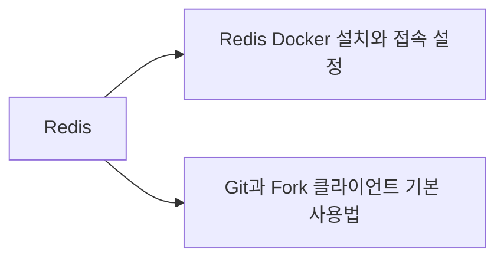
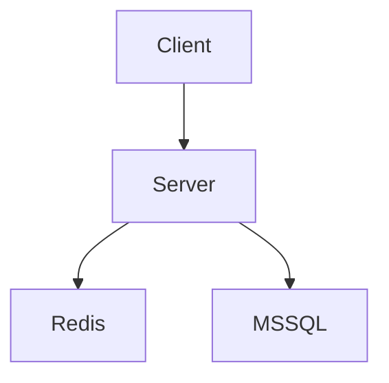

# VS Code Markdown 위키와 Foam 그래프 구성

## 요약

- Obsidian 없이도 **VS Code + Markdown + Git**으로 개인 위키를 관리할 수 있다.
- 문서 작성은 `Markdown All in One`, 형식 검사는 `markdownlint`, GitHub 결과 확인은 `Markdown Preview GitHub Styling`을 사용한다.
- 문서 관계 그래프와 백링크는 `Foam`으로 표현한다.
- 현재 위키에서 사용하는 `[[위키링크]]`는 Foam과 호환되므로 기존 문서를 크게 변경할 필요가 없다.
- 파일은 일반 `.md`이므로 Foam을 제거해도 문서 자체는 그대로 남는다.
- 일반적인 Git 작업은 VS Code 내장 Git 기능으로 충분하며, 변경 확인 → Stage → Commit → Pull/Push까지 VS Code 안에서 처리할 수 있다.
- Git 이력 추적은 `GitLens`, 복잡한 rebase/reset/cherry-pick이나 복구 작업은 `Fork`를 보조 도구로 사용하는 구성을 권장한다.

## 1. 권장 확장 구성

| 확장 | ID | 용도 | 필수 여부 |
| --- | --- | --- | --- |
| Markdown All in One | `yzhang.markdown-all-in-one` | 목차, 목록 편집, 단축키, 자동완성 | 권장 |
| markdownlint | `DavidAnson.vscode-markdownlint` | Markdown 규칙 검사와 자동 수정 | 권장 |
| Markdown Preview GitHub Styling | `bierner.markdown-preview-github-styles` | GitHub와 비슷한 미리보기 | 권장 |
| Markdown Preview Mermaid Support | `bierner.markdown-mermaid` | Mermaid 다이어그램 미리보기 | 권장 |
| Foam | `foam.foam-vscode` | 위키링크, 백링크, 지식 그래프 | 그래프 사용 시 필수 |
| GitLens | `eamodio.gitlens` | Commit/Blame/File History 등 Git 이력 확인 | Git 사용 시 권장 |

GitHub Pull Request를 VS Code에서 직접 관리하려면 `GitHub Pull Requests` 확장을, GitLab을 사용한다면 GitLab 공식 확장을 추가할 수 있다.

### PowerShell에서 설치

```powershell
code --install-extension yzhang.markdown-all-in-one
code --install-extension DavidAnson.vscode-markdownlint
code --install-extension bierner.markdown-preview-github-styles
code --install-extension bierner.markdown-mermaid
code --install-extension foam.foam-vscode
code --install-extension eamodio.gitlens
```

설치 후 VS Code를 다시 열거나 다음 명령을 실행한다.

1. `Ctrl + Shift + P`
2. `Developer: Reload Window`

## 2. 권장 VS Code 설정

저장소 루트의 `.vscode/settings.json`에 다음 설정을 사용할 수 있다.

```json
{
  "[markdown]": {
    "editor.wordWrap": "on",
    "editor.formatOnSave": true,
    "editor.defaultFormatter": "DavidAnson.vscode-markdownlint"
  },
  "markdown.copyFiles.destination": {
    "/**/*": "99_첨부/${documentBaseName}/"
  },
  "markdown.updateLinksOnFileMove.enabled": "always",
  "markdownlint.config": {
    "MD013": false,
    "MD033": false
  },
  "git.autofetch": true,
  "git.confirmSync": true,
  "git.enableSmartCommit": false,
  "git.pruneOnFetch": true,
  "git.allowForcePush": false,
  "git.useForcePushWithLease": true,
  "diffEditor.renderSideBySide": true,
  "diffEditor.ignoreTrimWhitespace": false,
  "git.mergeEditor": true,
  "gitlens.currentLine.enabled": true,
  "gitlens.codeLens.enabled": false
}
```

### Markdown 관련 설정

| 설정 | 의미 |
| --- | --- |
| `editor.wordWrap` | 긴 문장을 화면 너비에 맞춰 줄바꿈 |
| `editor.formatOnSave` | 저장할 때 Markdown 자동 정리 |
| `markdown.copyFiles.destination` | 붙여 넣은 이미지를 `99_첨부/문서명/`에 저장 |
| `markdown.updateLinksOnFileMove.enabled` | 문서를 이동하거나 이름을 바꿀 때 일반 Markdown 링크 갱신 |
| `MD013: false` | 한 줄 길이 제한을 사용하지 않음 |
| `MD033: false` | 필요한 HTML 태그 사용을 허용 |

VS Code 자체에서 이미지와 파일 붙여넣기를 지원하므로 일반적인 사용에는 별도의 이미지 붙여넣기 확장이 필요하지 않다.

### Git 관련 설정

| 설정 | 의미 |
| --- | --- |
| `git.autofetch` | 원격 저장소 변경 사항을 주기적으로 가져와 상태 표시 |
| `git.confirmSync` | Sync 실행 전에 확인하여 의도하지 않은 Pull/Push 방지 |
| `git.enableSmartCommit: false` | Stage하지 않은 변경까지 한 번에 Commit하는 실수 방지 |
| `git.pruneOnFetch` | 원격에서 삭제된 브랜치 참조 정리 |
| `git.allowForcePush: false` | VS Code UI에서 실수로 Force Push하는 것을 방지 |
| `git.useForcePushWithLease` | Force Push가 필요한 경우 더 안전한 `--force-with-lease` 사용 |
| `diffEditor.renderSideBySide` | 변경 전/후 코드를 좌우로 비교 |
| `diffEditor.ignoreTrimWhitespace: false` | 공백 변경도 Diff에서 확인 |
| `git.mergeEditor` | 충돌 시 3-way Merge Editor 사용 |
| `gitlens.currentLine.enabled` | 현재 줄의 마지막 변경 Commit 정보 확인 |
| `gitlens.codeLens.enabled: false` | 코드 위에 표시되는 GitLens 정보를 줄여 화면을 단순하게 유지 |

## 3. Foam 그래프 사용법

Foam은 Markdown 파일 사이의 링크를 분석해 문서를 노드로, 링크 관계를 선으로 표시한다.

### 전체 그래프 열기

1. 위키 저장소 루트를 VS Code에서 연다.
2. `Ctrl + Shift + P`를 누른다.
3. `Foam: Show Graph`를 실행한다.
4. 그래프 노드를 클릭하면 해당 문서가 열린다.

### 문서 연결하기

```markdown
# Redis

Redis를 컨테이너로 실행하는 방법은 [[Redis Docker 설치와 접속 설정]]을 참고한다.

버전 관리 방법은 [[Git과 Fork 클라이언트 기본 사용법]]을 참고한다.
```

위 문서는 그래프에서 다음과 같은 관계를 만든다.



### 백링크

문서 A에서 `[[문서 B]]`를 연결하면 문서 B에서는 자신을 참조하는 문서 A를 백링크로 확인할 수 있다.

- 정방향 링크: 현재 문서가 참조하는 문서
- 백링크: 현재 문서를 참조하는 다른 문서
- 고립 문서: 어떤 문서와도 연결되지 않은 문서

그래프는 문서가 같은 폴더에 있다는 이유만으로 연결하지 않는다. 실제 링크가 있어야 관계선이 만들어진다.

## 4. 위키링크와 일반 Markdown 링크

### 위키링크

```markdown
[[Redis Docker 설치와 접속 설정]]
```

장점:

- 입력이 짧다.
- Foam에서 자동완성과 백링크를 사용할 수 있다.
- 그래프 관계를 만들기 쉽다.

주의점:

- GitHub 저장소 화면에서는 일반 Markdown 링크처럼 동작하지 않을 수 있다.
- Foam이나 위키링크를 이해하는 도구에서 읽을 때 가장 편하다.

### 일반 Markdown 링크

```markdown
[Redis Docker 설치와 접속 설정](<./Redis Docker 설치와 접속 설정.md>)
```

장점:

- GitHub, VS Code 기본 미리보기 등 대부분의 Markdown 환경에서 동작한다.
- 특정 문서나 제목으로 연결되는 경로가 명확하다.

주의점:

- 파일 경로가 길면 작성이 번거롭다.
- 파일 이동 시 링크 경로 관리가 필요하다.

### 이 위키의 권장 규칙

- 내부 지식 관계와 Foam 그래프에는 `[[위키링크]]`를 사용한다.
- 외부 공유나 GitHub 화면에서 반드시 클릭되어야 하는 링크에는 일반 Markdown 링크를 사용한다.
- 외부 웹페이지에는 `[표시 이름](URL)` 형식을 사용한다.
- 파일명은 중복되지 않게 작성해 `[[문서 이름]]`이 모호해지지 않도록 한다.

## 5. Mermaid 다이어그램

문서 간의 실제 연결 관계는 Foam 그래프로 확인하고, 특정 시스템 구조를 설명할 때는 Mermaid를 사용한다.

````markdown

````

- Foam 그래프: 위키 전체의 문서 관계를 자동으로 표현
- Mermaid: 작성자가 의도한 시스템 구조와 흐름을 정확하게 표현

두 그래프는 목적이 다르므로 함께 사용할 수 있다.

## 6. VS Code를 Git 클라이언트로 사용하기

VS Code에는 Git 기능이 기본 내장되어 있어 일상적인 Git 작업은 별도의 GUI 클라이언트 없이 처리할 수 있다.

```text
파일 수정
  ↓
Diff 확인
  ↓
Stage
  ↓
Commit
  ↓
Pull / Push
```

Source Control 화면은 `Ctrl + Shift + G`로 열 수 있다.

### 기본 작업 흐름

1. 파일을 수정한다.
2. `Ctrl + Shift + G`로 Source Control을 연다.
3. 변경 파일을 클릭해 Diff를 확인한다.
4. 원하는 파일의 `+` 버튼을 눌러 Stage한다.
5. Commit 메시지를 작성한다.
6. `Commit`을 실행한다.
7. `Push`를 실행한다.

CLI로 표현하면 다음과 거의 동일하다.

```bash
git add <파일>
git commit -m "커밋 메시지"
git push
```

전체 변경을 무조건 한 번에 Stage하기보다 Commit 목적에 맞는 파일만 선택해서 Stage하는 습관을 권장한다.

## 7. VS Code에서 Push하기

Fork를 열지 않아도 VS Code에서 바로 Push할 수 있다.

### 일반 Push

1. `Ctrl + Shift + G`로 Source Control을 연다.
2. Stage와 Commit을 완료한다.
3. Source Control 우측 상단 `...` 메뉴를 연다.
4. `Push`를 선택한다.

CLI에서는 다음 명령과 같다.

```bash
git push
```

### 처음 만든 브랜치 Push

로컬에서 새 브랜치를 만든 후 아직 원격 브랜치가 없다면 VS Code에 `Publish Branch`가 표시된다.

예를 들어 로컬 브랜치가 `feature/login`이라면 개념적으로 다음 명령과 같다.

```bash
git push -u origin feature/login
```

`-u` 옵션으로 upstream을 한 번 연결하면 이후에는 단순히 다음 명령만 사용하면 된다.

```bash
git push
```

### 상태바의 화살표 의미

VS Code에 다음처럼 표시될 수 있다.

```text
main  ↓1 ↑2
```

- `↓1`: 원격 저장소에 있지만 로컬에는 아직 없는 Commit이 1개
- `↑2`: 로컬에는 있지만 원격 저장소에 아직 Push하지 않은 Commit이 2개

이를 확인하면 Pull이 필요한지, Push가 필요한지 빠르게 판단할 수 있다.

## 8. Push와 Sync Changes 차이

`Push`는 현재 로컬 Commit을 원격으로 보내는 작업이다.

```text
Local Repository
      │
      │ Push
      ▼
Remote Repository
```

반면 VS Code의 `Sync Changes`는 원격 변경을 가져오고 로컬 변경을 보내는 동기화 작업이다.

개념적으로는 다음 흐름으로 이해하면 쉽다.

```text
Pull
 ↓
Push
```

Git을 처음 익힐 때는 `Sync Changes`만 사용하는 것보다 `Pull`과 `Push`를 직접 구분해서 실행하는 것을 권장한다. 어떤 방향으로 데이터가 이동하는지 이해하기 쉽고, 의도하지 않은 동기화를 줄일 수 있다.

## 9. GitLens의 역할

VS Code 내장 Git은 현재 변경 내용을 다루는 데 강하고, GitLens는 **과거 변경 이력을 추적하는 용도**로 사용하면 좋다.

주요 사용 예시는 다음과 같다.

- 현재 코드 한 줄을 마지막으로 수정한 Commit 확인
- 해당 변경을 누가 언제 했는지 확인
- 파일 단위 Commit History 확인
- 이전 버전과 현재 버전 비교
- 특정 코드가 추가되거나 변경된 이유 추적

즉 다음처럼 역할을 나눌 수 있다.

```text
VS Code Git
└─ 지금 변경하고 있는 내용 관리

GitLens
└─ 과거에 왜 이렇게 변경되었는지 추적
```

## 10. Fork와 VS Code 역할 분리

일반적인 작업은 VS Code만으로 처리하고, Git 그래프를 보면서 복잡한 이력 작업을 해야 할 때 Fork를 사용하는 방식을 권장한다.

### VS Code에서 처리하기 좋은 작업

```text
VS Code
├─ 파일 수정
├─ Diff 확인
├─ Stage / Unstage
├─ Commit
├─ Pull
├─ Push
└─ 간단한 Merge Conflict 해결
```

### Fork에서 처리하기 좋은 작업

```text
Fork
├─ 전체 Branch / Commit Graph 확인
├─ Rebase
├─ Cherry-pick
├─ Reset
├─ Stash 관리
├─ 복잡한 Merge
└─ Git 이력이 꼬였을 때 복구
```

Fork가 있어야 Push할 수 있는 것은 아니다. **일상 작업은 VS Code, 이력 구조를 직접 다루는 작업은 Fork**로 구분하면 편하다.

관련 Git/Fork 기본 개념과 명령은 [[Git과 Fork 클라이언트 기본 사용법]]도 참고한다.

## 11. Git 전역 설정 권장값

개발 PC에서 한 번 설정해두면 여러 저장소에서 공통으로 적용할 수 있다.

```powershell
git config --global user.name "사용자 이름"
git config --global user.email "사용자 이메일"

git config --global init.defaultBranch main
git config --global fetch.prune true
git config --global pull.ff only
git config --global core.editor "code --wait"
```

### `pull.ff only`

```powershell
git config --global pull.ff only
```

Pull 과정에서 자동으로 Merge Commit이 만들어지는 것을 막고, fast-forward가 가능한 경우에만 Pull하도록 제한한다.

로컬과 원격에 각각 별도 Commit이 생겨 브랜치가 갈라졌다면 Pull을 자동으로 해결하지 않고 사용자가 직접 Merge 또는 Rebase 방식을 선택하게 된다.

Git 동작을 익히는 단계에서는 의도하지 않은 Merge Commit을 줄이는 데 도움이 된다.

## 12. 추천 Git 운영 방식

개인 위키나 일반 개발 작업에서는 다음 흐름을 기본으로 사용한다.

```text
VS Code
├─ 코드/문서 수정
├─ Diff 확인
├─ 필요한 파일만 Stage
├─ Commit
├─ Pull 필요 여부 확인
└─ Push

GitLens
└─ 변경 이력과 Blame 확인

Fork
└─ Rebase / Reset / Cherry-pick / 복잡한 복구

GitHub / GitLab
└─ 원격 저장소 / PR(MR) / 협업
```

기본 작업에서 Fork를 항상 실행할 필요는 없다. VS Code에서 작업하다가 Commit Graph를 자세히 확인하거나 복잡한 이력 수정이 필요할 때 Fork를 열면 된다.

## 13. 위키 추천 운영 방식

1. `00_인덱스/INBOX.md`에 먼저 기록한다.
2. 오래 유지할 내용은 `30_지식/`에 주제별 문서로 정리한다.
3. 관련 문서를 `[[위키링크]]`로 연결한다.
4. `Foam: Show Graph`에서 고립된 문서와 연결 관계를 확인한다.
5. `Ctrl + Shift + G`에서 변경 내용을 확인한다.
6. 필요한 파일만 Stage하고 Commit한다.
7. 원격 변경이 있는지 확인한 뒤 Pull 또는 Push한다.

```text
VS Code
├─ Markdown 작성
├─ 미리보기
├─ Foam 그래프와 백링크
└─ Git 변경 확인 / Commit / Push
        ↓
GitHub
└─ 문서 이력과 원격 보관
```

## 14. 결론

이 위키에는 다음 구성이 적합하다.

```text
VS Code
+ Markdown All in One
+ markdownlint
+ GitHub Styling
+ Mermaid Support
+ Foam
+ GitLens
+ Git

필요할 때만 Fork
```

Obsidian을 실행하거나 연동하지 않아도 Markdown 작성, 미리보기, 문서 관계 그래프, 백링크, 변경 이력 확인, Commit과 Push까지 대부분의 작업을 VS Code 안에서 처리할 수 있다.

Fork는 필수 Git 클라이언트라기보다 복잡한 Branch/Commit 이력 작업을 시각적으로 처리하기 위한 보조 도구로 사용한다.

## 참고 자료

- [VS Code Markdown 공식 문서](https://code.visualstudio.com/docs/languages/markdown)
- [VS Code Source Control 공식 문서](https://code.visualstudio.com/docs/sourcecontrol/overview)
- [VS Code Git 공식 문서](https://code.visualstudio.com/docs/sourcecontrol/intro-to-git)
- [GitLens](https://marketplace.visualstudio.com/items?itemName=eamodio.gitlens)
- [Foam 공식 문서](https://foambubble.github.io/foam/)
- [Foam - Visual Studio Marketplace](https://marketplace.visualstudio.com/items?itemName=foam.foam-vscode)
- [Markdown All in One](https://marketplace.visualstudio.com/items?itemName=yzhang.markdown-all-in-one)
- [markdownlint](https://marketplace.visualstudio.com/items?itemName=DavidAnson.vscode-markdownlint)
- [Markdown Preview GitHub Styling](https://marketplace.visualstudio.com/items?itemName=bierner.markdown-preview-github-styles)
- [Markdown Preview Mermaid Support](https://marketplace.visualstudio.com/items?itemName=bierner.markdown-mermaid)
