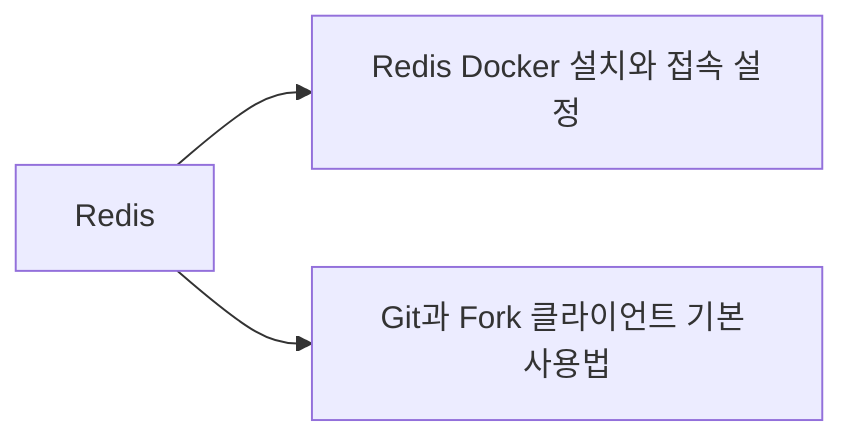
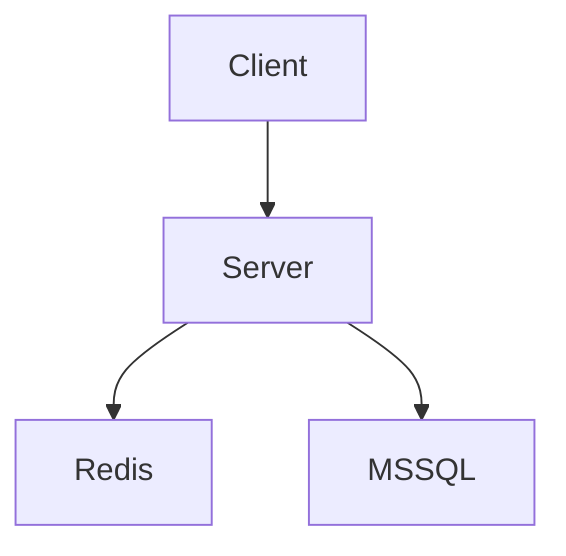

# VS Code Markdown 위키와 Foam 그래프 구성

## 요약

- Obsidian 없이도 **VS Code + Markdown + Git**으로 개인 위키를 관리할 수 있다.
- 문서 작성은 `Markdown All in One`, 형식 검사는 `markdownlint`, GitHub 결과 확인은 `Markdown Preview GitHub Styling`을 사용한다.
- 문서 관계 그래프와 백링크는 `Foam`으로 표현한다.
- 현재 위키에서 사용하는 `[[위키링크]]`는 Foam과 호환되므로 기존 문서를 크게 변경할 필요가 없다.
- 파일은 일반 `.md`이므로 Foam을 제거해도 문서 자체는 그대로 남는다.
- Foam Queries와 `.foam/queries/` 저장 쿼리를 사용하면 문서를 추가할 때 인덱스와 점검 목록이 자동으로 갱신된다.

## 1. 권장 확장 구성

| 확장 | ID | 용도 | 필수 여부 |
| --- | --- | --- | --- |
| Markdown All in One | `yzhang.markdown-all-in-one` | 목차, 목록 편집, 단축키, 자동완성 | 권장 |
| markdownlint | `DavidAnson.vscode-markdownlint` | Markdown 규칙 검사와 자동 수정 | 권장 |
| Markdown Preview GitHub Styling | `bierner.markdown-preview-github-styles` | GitHub와 비슷한 미리보기 | 권장 |
| Markdown Preview Mermaid Support | `bierner.markdown-mermaid` | Mermaid 다이어그램 미리보기 | 권장 |
| Foam | `foam.foam-vscode` | 위키링크, 백링크, 지식 그래프 | 그래프 사용 시 필수 |

### PowerShell에서 설치

```powershell
code --install-extension yzhang.markdown-all-in-one
code --install-extension DavidAnson.vscode-markdownlint
code --install-extension bierner.markdown-preview-github-styles
code --install-extension bierner.markdown-mermaid
code --install-extension foam.foam-vscode
```

설치 후 VS Code를 다시 열거나 다음 명령을 실행한다.

1. `Ctrl + Shift + P`
2. `Developer: Reload Window`

## 2. 권장 VS Code 설정

저장소 루트의 `.vscode/settings.json`에 다음 설정을 사용할 수 있다.

```json
{
  "[markdown]": {
    "editor.wordWrap": "on",
    "editor.formatOnSave": true,
    "editor.defaultFormatter": "DavidAnson.vscode-markdownlint"
  },
  "markdown.copyFiles.destination": {
    "/**/*": "99_첨부/${documentBaseName}/"
  },
  "markdown.updateLinksOnFileMove.enabled": "always",
  "markdownlint.config": {
    "MD013": false,
    "MD033": false
  }
}
```

| 설정 | 의미 |
| --- | --- |
| `editor.wordWrap` | 긴 문장을 화면 너비에 맞춰 줄바꿈 |
| `editor.formatOnSave` | 저장할 때 Markdown 자동 정리 |
| `markdown.copyFiles.destination` | 붙여 넣은 이미지를 `99_첨부/문서명/`에 저장 |
| `markdown.updateLinksOnFileMove.enabled` | 문서를 이동하거나 이름을 바꿀 때 일반 Markdown 링크 갱신 |
| `MD013: false` | 한 줄 길이 제한을 사용하지 않음 |
| `MD033: false` | 필요한 HTML 태그 사용을 허용 |

VS Code 자체에서 이미지와 파일 붙여넣기를 지원하므로 일반적인 사용에는 별도의 이미지 붙여넣기 확장이 필요하지 않다.

## 3. Foam 그래프 사용법

Foam은 Markdown 파일 사이의 링크를 분석해 문서를 노드로, 링크 관계를 선으로 표시한다.

### 전체 그래프 열기

1. 위키 저장소 루트를 VS Code에서 연다.
2. `Ctrl + Shift + P`를 누른다.
3. `Foam: Show Graph`를 실행한다.
4. 그래프 노드를 클릭하면 해당 문서가 열린다.

### 문서 연결하기

```markdown
# Redis

Redis를 컨테이너로 실행하는 방법은 [[Redis Docker 설치와 접속 설정]]을 참고한다.

버전 관리 방법은 [[Git과 Fork 클라이언트 기본 사용법]]을 참고한다.
```

위 문서는 그래프에서 다음과 같은 관계를 만든다.



### 백링크

문서 A에서 `[[문서 B]]`를 연결하면 문서 B에서는 자신을 참조하는 문서 A를 백링크로 확인할 수 있다.

- 정방향 링크: 현재 문서가 참조하는 문서
- 백링크: 현재 문서를 참조하는 다른 문서
- 고립 문서: 어떤 문서와도 연결되지 않은 문서

그래프는 문서가 같은 폴더에 있다는 이유만으로 연결하지 않는다. 실제 링크가 있어야 관계선이 만들어진다.

## 4. Foam Queries로 문서 자동 집계

Foam Queries는 Markdown 문서의 YAML 속성, 태그, 경로와 링크 정보를 조회해 목록·표·개수를 자동으로 만든다. Obsidian Dataview와 비슷한 역할을 하며 Foam에 포함되어 있으므로 별도의 Dataview 확장이 필요하지 않다.

쿼리는 한 번 정의해야 하지만, 저장한 뒤에는 문서를 추가하거나 메타데이터를 수정할 때 결과가 자동으로 갱신된다.

### 이 위키에 적용한 저장 쿼리

저장 쿼리는 `.foam/queries/`에 있으며 VS Code의 Foam 사이드바에서 스마트 폴더로 재사용할 수 있다.

| 파일 | 표시 이름 | 용도 |
| --- | --- | --- |
| `.foam/queries/전체_지식.yaml` | 전체 지식 | `type: 지식` 문서를 최근 수정일 순으로 확인 |
| `.foam/queries/최근_수정.yaml` | 최근 수정 | 보관 문서를 제외한 최근 수정 문서 20개 확인 |
| `.foam/queries/태그_없는_지식.yaml` | 태그 없는 지식 | 태그 정리가 필요한 지식 문서 확인 |
| `.foam/queries/연결_점검.yaml` | 연결 점검 | 백링크가 적은 지식 문서부터 확인 |

사용 순서는 다음과 같다.

1. 저장소 루트를 VS Code에서 연다.
2. Foam 확장이 쿼리를 인식하지 못하면 `Developer: Reload Window`를 실행한다.
3. Foam 사이드바의 Smart Folders에서 저장 쿼리를 선택한다.
4. 결과의 문서 제목을 선택해 해당 문서로 이동한다.

### 문서 안에 자동 표 표시

`30_지식/지식_인덱스.md`에는 다음 쿼리가 적용되어 있다.

```foam-query
filter:
  type: "지식"
select:
  - title
  - tags
  - field: properties.updated
    label: 수정일
sort: properties.updated DESC
format: table
limit: 200
```

문서에 다음 메타데이터가 있으면 자동 목록에 포함된다.

```yaml
---
type: 지식
created: 2026-08-21
updated: 2026-08-21
tags: [VSCode, Markdown, Foam]
---
```

따라서 새로운 지식 문서를 만들 때 `type: 지식`을 지정하고 `updated`, `tags`를 관리하면 자동 표를 직접 수정할 필요가 없다.

### 저장 쿼리 예제

`.foam/queries/전체_지식.yaml`은 다음과 같이 구성되어 있다.

```yaml
name: 전체 지식
description: 지식 문서를 최근 수정일 순으로 표시합니다.
filter:
  type: "지식"
select:
  - title
  - tags
  - field: properties.updated
    label: 수정일
sort: properties.updated DESC
limit: 200
```

### 표시 위치와 주의사항

- `foam-query` 결과는 VS Code의 Markdown 미리보기에서 표시된다.
- GitHub에서는 쿼리가 실행되지 않고 코드 블록으로 보이므로 주요 링크는 수동 목록으로도 유지한다.
- 일반적인 조회에는 YAML 기반 `foam-query`를 사용한다.
- `foam-query-js`는 신뢰된 워크스페이스에서 VS Code와 같은 권한으로 실행되므로, 직접 작성했거나 신뢰하는 코드만 사용한다.

## 5. 위키링크와 일반 Markdown 링크

### 위키링크

```markdown
[[Redis Docker 설치와 접속 설정]]
```

장점:

- 입력이 짧다.
- Foam에서 자동완성과 백링크를 사용할 수 있다.
- 그래프 관계를 만들기 쉽다.

주의점:

- GitHub 저장소 화면에서는 일반 Markdown 링크처럼 동작하지 않을 수 있다.
- Foam이나 위키링크를 이해하는 도구에서 읽을 때 가장 편하다.

### 일반 Markdown 링크

```markdown
[Redis Docker 설치와 접속 설정](<./Redis Docker 설치와 접속 설정.md>)
```

장점:

- GitHub, VS Code 기본 미리보기 등 대부분의 Markdown 환경에서 동작한다.
- 특정 문서나 제목으로 연결되는 경로가 명확하다.

주의점:

- 파일 경로가 길면 작성이 번거롭다.
- 파일 이동 시 링크 경로 관리가 필요하다.

### 이 위키의 권장 규칙

- 내부 지식 관계와 Foam 그래프에는 `[[위키링크]]`를 사용한다.
- 외부 공유나 GitHub 화면에서 반드시 클릭되어야 하는 링크에는 일반 Markdown 링크를 사용한다.
- 외부 웹페이지에는 `[표시 이름](URL)` 형식을 사용한다.
- 파일명은 중복되지 않게 작성해 `[[문서 이름]]`이 모호해지지 않도록 한다.

## 6. Mermaid 다이어그램

문서 간의 실제 연결 관계는 Foam 그래프로 확인하고, 특정 시스템 구조를 설명할 때는 Mermaid를 사용한다.

````markdown

````

- Foam 그래프: 위키 전체의 문서 관계를 자동으로 표현
- Mermaid: 작성자가 의도한 시스템 구조와 흐름을 정확하게 표현

두 그래프는 목적이 다르므로 함께 사용할 수 있다.

## 7. 추천 운영 방식

1. `00_인덱스/INBOX.md`에 먼저 기록한다.
2. 오래 유지할 내용은 `30_지식/`에 주제별 문서로 정리한다.
3. 관련 문서를 `[[위키링크]]`로 연결한다.
4. Foam 저장 쿼리와 `지식_인덱스`의 자동 표에서 누락된 태그와 최근 변경을 확인한다.
5. `Foam: Show Graph`와 `연결 점검` 쿼리에서 문서 연결 관계를 확인한다.
6. Git 변경 내용을 확인하고 Commit 및 Push한다.

```text
VS Code
├─ Markdown 작성
├─ 미리보기
├─ Foam 그래프와 백링크
└─ Git 변경 확인
        ↓
GitHub
└─ 문서 이력과 원격 보관
```

## 8. 결론

이 위키에는 다음 구성이 적합하다.

```text
VS Code
+ Markdown All in One
+ markdownlint
+ GitHub Styling
+ Mermaid Support
+ Foam
+ Git
```

Obsidian을 실행하거나 연동하지 않아도 Markdown 작성, 미리보기, 문서 관계 그래프, 백링크, 버전 관리를 VS Code 안에서 처리할 수 있다.

## 참고 자료

- [VS Code Markdown 공식 문서](https://code.visualstudio.com/docs/languages/markdown)
- [Foam 공식 문서](https://foambubble.github.io/foam/)
- [Foam Queries 공식 문서](https://github.com/foambubble/foam/blob/main/docs/user/features/foam-queries.md)
- [Foam - Visual Studio Marketplace](https://marketplace.visualstudio.com/items?itemName=foam.foam-vscode)
- [Markdown All in One](https://marketplace.visualstudio.com/items?itemName=yzhang.markdown-all-in-one)
- [markdownlint](https://marketplace.visualstudio.com/items?itemName=DavidAnson.vscode-markdownlint)
- [Markdown Preview GitHub Styling](https://marketplace.visualstudio.com/items?itemName=bierner.markdown-preview-github-styles)
- [Markdown Preview Mermaid Support](https://marketplace.visualstudio.com/items?itemName=bierner.markdown-mermaid)
